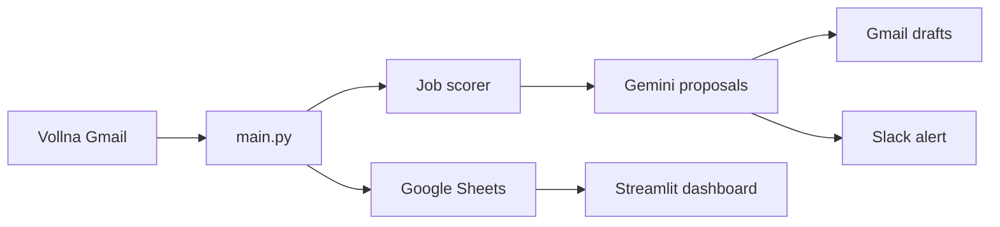

# Upwork AI Proposal Agent

[](https://www.python.org/downloads/)
[](LICENSE)
[](https://streamlit.io)

End-to-end **Python automation** that turns Vollna job alerts into scored, AI-written Upwork proposals — with a **Streamlit portfolio dashboard** backed by Google Sheets.

**Stack:** Python · Gmail API · Google Gemini · Google Sheets · Slack · Streamlit  
**Cost:** $0 on free tiers (Gmail, Gemini, Sheets, Slack, Streamlit Cloud)

**Repository:** [github.com/mariabatool869-star/upwork-proposal-agent](https://github.com/mariabatool869-star/upwork-proposal-agent)

---

## What it does

| Module | Role |
|--------|------|
| **Gmail reader** | Fetches Vollna HTML job alerts (`info@vollna.com`) |
| **Job parser** | Extracts title, budget, description, and job URLs |
| **Job scorer** | Rates each job 1–10 against your skills profile |
| **Proposal writer** | Generates tailored proposals via Google Gemini |
| **Gmail drafts** | Saves proposals for review before you submit on Upwork |
| **Google Sheets** | Logs every job — single source of truth for the dashboard |
| **Slack notifier** | Alerts you when a draft is ready |
| **Streamlit dashboard** | Portfolio UI: overview, proposals, analytics |

---

## How it fits together

The **agent runs on your computer**. The **dashboard reads Google Sheets** — locally or on Streamlit Cloud. Same spreadsheet, always in sync after you refresh.

```text
┌─────────────────────────────────────────────────────────────────┐
│  YOUR PC (local only)                                           │
│                                                                 │
│  Vollna email → main.py → score → Gemini → Gmail draft          │
│                    │                                            │
│                    └──────────────► Google Sheets (append row)│
└─────────────────────────────────────────────────────────────────┘
                                    │
                                    ▼
┌─────────────────────────────────────────────────────────────────┐
│  DASHBOARD (local OR Streamlit Cloud)                           │
│                                                                 │
│  dashboard/app.py  ──reads──►  Google Sheets  ──►  charts & UI  │
└─────────────────────────────────────────────────────────────────┘
```



---

## Quick start (local)

### 1. Clone and install

```bash
git clone https://github.com/mariabatool869-star/upwork-proposal-agent.git
cd upwork-proposal-agent

python -m venv .venv

# Windows
.venv\Scripts\activate

# macOS / Linux
source .venv/bin/activate

python -m pip install --upgrade pip
python -m pip install -r requirements.txt -r requirements-agent.txt
```

### 2. Configuration

```bash
# Windows
copy config_sample.py config.py
copy .env.example .env

# macOS / Linux
cp config_sample.py config.py
cp .env.example .env
```

| File | Action |
|------|--------|
| `config.py` | Edit `PROFILE` — skills, rate, bio, experience |
| `.env` | Add API keys and `GOOGLE_SHEETS_ID` (see [Configuration](#configuration)) |
| `credentials/gmail_oauth.json` | Gmail OAuth client (Web application) |
| `credentials/sheets_service.json` | Google Sheets service account JSON |

Share your Google Sheet with the **service account email** (Editor access).  
On first run, complete Gmail OAuth in the browser; `credentials/token.json` is created automatically.

### 3. Run

```bash
# Process job emails once
python main.py

# Portfolio dashboard (localhost)
python -m streamlit run dashboard/app.py
```

Open **http://localhost:8501** — demo login: `demo` / `demo123`

| Windows shortcut | Action |
|------------------|--------|
| `run_once.bat` | Single agent run |
| `run_loop.bat` | Agent every 30 minutes |
| `run_dashboard.bat` | Start Streamlit dashboard |

After `python main.py`, click **Refresh data** in the dashboard sidebar to load new rows.

---

## Deploy dashboard on Streamlit Cloud

The **agent stays local**. Only the **dashboard** is deployed — it displays data from Google Sheets.

### 1. Generate secrets (on your PC)

```bash
python prepare_streamlit_secrets.py
```

Copy the full TOML output.

### 2. Create the app

1. Go to [share.streamlit.io](https://share.streamlit.io)
2. **New app** → connect this GitHub repo
3. **Main file path:** `dashboard/app.py`
4. **Python version:** 3.11 or 3.12
5. **Secrets** → paste the TOML (must include `[gcp_service_account]`)
6. **Deploy**

### 3. Secrets checklist

| Secret | Required |
|--------|----------|
| `GOOGLE_SHEETS_ID` | Yes |
| `MY_NAME` | Yes |
| `[gcp_service_account]` | Yes — full block from `credentials/sheets_service.json` |
| `GEMINI_API_KEY` | Optional on Cloud (agent runs locally) |
| `SLACK_WEBHOOK_URL` | Optional on Cloud |

After saving secrets, **Reboot app**. Share the sheet with the service account email.

### 4. Daily workflow

```bash
python main.py              # local — writes to Sheets
# Open Streamlit Cloud URL → Refresh data
```

---

## Configuration

### Environment variables (`.env`)

| Variable | Required | Description |
|----------|----------|-------------|
| `GEMINI_API_KEY` | Yes | From [Google AI Studio](https://aistudio.google.com/apikey) (`AIza…`) |
| `GOOGLE_SHEETS_ID` | Yes | Spreadsheet ID from the Sheets URL |
| `SLACK_WEBHOOK_URL` | Yes | Slack incoming webhook |
| `MY_NAME` | Yes | Name in proposal signatures |
| `GEMINI_MODELS` | No | Fallback models if quota is hit |
| `SCORE_THRESHOLD` | No | Min score to draft (default `6`) |
| `MIN_BUDGET_HOURLY` | No | Skip hourly jobs below this (default `15`) |
| `MIN_BUDGET_FIXED` | No | Skip fixed jobs below this (default `100`) |
| `POLL_INTERVAL_MINUTES` | No | Loop interval (default `30`) |

### Profile (`config.py`)

Copy from `config_sample.py`. Customize skills, rate, bio, and `experience_highlights` — used by the scorer, Gemini, and dashboard.

---

## Project structure

```text
upwork-proposal-agent/
├── main.py                    # Agent orchestrator (local only)
├── config_sample.py           # Profile template → copy to config.py
├── project_config.py          # Committed config fallback (Streamlit Cloud)
├── config_loader.py           # Local config.py or project_config.py
├── gmail_reader.py            # Gmail API
├── job_parser.py                # Vollna email parser
├── job_scorer.py                # Job scoring (1–10)
├── proposal_writer.py           # Gemini proposals
├── sheets_client.py             # Shared Sheets connection
├── sheets_logger.py             # Append rows to Sheets
├── slack_notifier.py            # Slack webhooks
├── prepare_streamlit_secrets.py # Generate Streamlit Cloud secrets TOML
├── dashboard/
│   ├── app.py                   # Streamlit dashboard (Cloud entrypoint)
│   ├── auth.py                  # Demo login
│   └── data_utils.py            # Sheets data & charts
├── credentials/                 # Google keys (gitignored)
├── .streamlit/
│   ├── config.toml              # Dashboard theme
│   └── secrets.toml.example     # Secrets template
├── requirements.txt             # Dashboard / Streamlit Cloud
├── requirements-agent.txt       # Extra deps for local agent
├── run_once.bat                 # Windows shortcuts
├── run_loop.bat
└── run_dashboard.bat
```

---

## Security

**Never commit:**

| Path | Contains |
|------|----------|
| `.env` | API keys, webhooks, sheet ID |
| `credentials/` | OAuth client, service account, Gmail token |
| `config.py` | Personal profile |
| `logs/` / `data/` | Job history |

Before every push:

```powershell
git check-ignore -v .env credentials config.py
git status
```

If secrets were ever pushed, rotate all keys and scrub git history.

---

## Troubleshooting

| Problem | Fix |
|---------|-----|
| Dashboard: *Google Sheets credentials missing* | Run `python prepare_streamlit_secrets.py`; paste full TOML into Streamlit **Secrets** including `[gcp_service_account]`; reboot app |
| Dashboard: *Permission denied* | Share the sheet with the service account email (Editor) |
| Dashboard empty after agent run | Click **Refresh data** in the sidebar |
| `GEMINI_API_KEY is not set` | Add key to `.env` |
| `Missing credentials/gmail_oauth.json` | Add OAuth JSON to `credentials/` |
| Gmail token expired | Delete `credentials/token.json`; run `python main.py` again |
| No Vollna emails | Use the Gmail account that receives Vollna alerts |
| Re-process old emails | Delete `data/processed_emails.json`; run agent again |
| Streamlit Cloud: `import config` fails | Expected — Cloud uses `project_config.py` + Secrets (not `config.py`) |

---

## Contributing

Contributions welcome under the [MIT License](LICENSE).

1. Fork the repo
2. `git checkout -b feature/your-feature`
3. Test: `python main.py` and `streamlit run dashboard/app.py`
4. Open a Pull Request (no secrets in commits)

---

## License

**MIT License** — see [LICENSE](LICENSE).

---

## Author

**Maria Batool** — AI Automation Developer · 13+ years

Portfolio project demonstrating production-style workflow automation: Gmail ingestion, LLM proposals, structured logging, and a live analytics dashboard.
